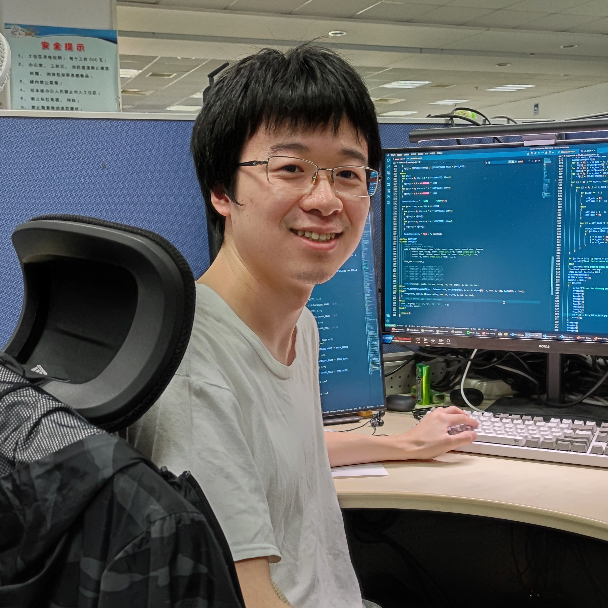

<!---
# Chendi Li

-->

<!---
-->

I am currently a PhD student at the University of Utah, and advised by Prof. [**P. (Saday) Sadayappan**](https://www.cs.utah.edu/~saday/){:target="_blank"}. I got my master degree from the State Key Laboratory of Computer Architecture, Institute of Computing Technology, Chinese Academy of Sciences, and supervised by Prof. [**Yunquan Zhang**](https://dblp.org/pid/17/6660.html){:target="_blank"}. Please refer to my short [resume](https://www.lichendi.top/Chendi_Li_Resume.pdf){:target="_blank"}. If you have any questions, feel free to contact me by [email](mailto:lichendi.cs@gmail.com).

### Research Interests

* High-Performance Computing
 
* Matrix/Tensor Optimization
 
* High-Performance Machine learning

### Research projects
* **AutoTSMM (Author)**

Designed AutoTSMM, which is used to build high-performance tall-and-skinny matrix multiplication on mainstream CPUs. AutoTSMM can speed up convolution layers in real-world deep learning applications, and the performance is competitive with Intel OneMKL and outperforms all conventional GEMM implementations. This work was published in IEEE ISPA 2021.

* **OpenBLAS (Contributor)**

Optimized pre-pack matrix-matrix multiplication and triangular solve with multiple right-hand-sides(TRSM) on ARMv8 and X86 platforms. OpenBLAS is one of the most famous open-source BLAS libraries.

* **IAAT (Contributor)**

Launched the project and investigated JIT tools for small GEMM. IAAT is a template-driven just-in-time(JIT) small GEMM framework targeting CPUs. This work was accepted by IEEE ICPADS 2021.

* **OpenVML (Co-author)**
  
Enhanced the math functions by manipulating IEEE 754 floating points. OpenVML is a vector mathematical library. It achieves an outstanding performance improvement compared to C standard library and ARMPL. This work was accepted by HPC China 2020.

* **AutoFFT (Contributor)**

Optimized small-scale FFT, and contributed to multi-threading and 2D-FFT. AutoFFT is a template-based FFT codes auto-generation framework that contributes to many Chinese vendors' libraries. This work was published in SC'19, TPDS'20, and was accepted by HPCC'21.

<!-- ### Awards & Honors
2021: First-Class Scholarship of Chinese Academy of Sciences
 
2020: Second-class scholarship of Chinese Academy of Sciences
 
2019: Third-Class Scholarship of Chinese Academy of Sciences
 
2015: Collegiate programming contest first prize

### Invited Talks

ISPA'21: AutoTSMM: An Auto-tuning Framework for Building High-Performance Tall-and-Skinny Matrix-Matrix Multiplication on CPUs (IEEE ISPA 2021, Virtual Conference)([Youtube](https://www.youtube.com/watch?v=NjIla6zXRHM){:target="_blank"})

HPC-CHINA'20: OpenVML: Fast Computation of Elementary Functions on ARM Platforms(CCF HPC CHINA 2020, Virtual Conference)

### Services
Student Volunteer at HPC CHINA 2021
 
Student Volunteer at HPC CHINA 2020
 
Student Volunteer at HPC CHINA 2019  -->

---
