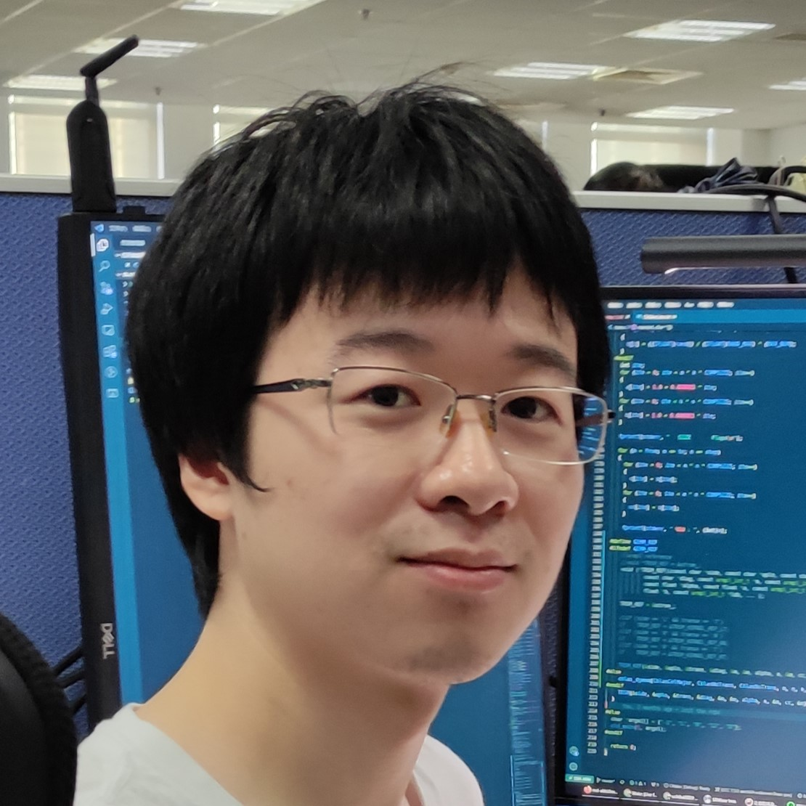

<!---
# Chendi Li

-->

<!---
-->

I am currently a PhD student at the University of Utah, and advised by Prof. [**P. (Saday) Sadayappan**](https://www.cs.utah.edu/~saday/){:target="_blank"}. I got my master degree from the State Key Laboratory of Computer Architecture, Institute of Computing Technology, Chinese Academy of Sciences, and supervised by Prof. [**Yunquan Zhang**](https://dblp.org/pid/17/6660.html){:target="_blank"}. Please refer to my short [resume](https://www.lichendi.top/Chendi_Li_Resume.pdf){:target="_blank"}. If you have any questions, feel free to contact me by [email](mailto:lichendi.cs@gmail.com).

### Research Interests

* High-Performance Computing
 
* Matrix/Tensor Optimization
 
* High-Performance Machine learning

### Publications

**[ICS 2024]** **Chendi Li\***, Yufan Xu\*,, Sina Mahdipour Saravani, Ponnuswamy Sadayappan.  
<a href="https://dl.acm.org/doi/abs/10.1145/3650200.3656626" target="_blank"><b>Accelerated Auto-Tuning of GPU Kernels for Tensor Computations</b></a>. ICS 2024: 549-561.

**[IEEE TPDS 2024]** Cunyang Wei, Haipeng Jia, Yunquan Zhang, Jianyu Yao, **Chendi Li**, Wenxuan Cao.  
<a href="https://ieeexplore.ieee.org/abstract/document/10607886/" target="_blank"><b>IrGEMM: An Input-Aware Tuning Framework for Irregular GEMM on ARM and X86 CPUs</b></a>. IEEE Trans. Parallel Distributed Syst. 35(9): 1672-1689 (2024).

**[ICS 2023]** Tun Chen, Haipeng Jia, Yunquan Zhang, Kun Li, Zhihao Li, Xiang Zhao, Jianyu Yao, **Chendi Li**.  
<a href="https://dl.acm.org/doi/abs/10.1145/3577193.3593735" target="_blank"><b>OpenFFT: An Adaptive Tuning Framework for 3D FFT on ARM Multicore CPUs</b></a>. ICS 2023: 398-409.

**[HPCC 2021]** Tun Chen, Haipeng Jia, Zhihao Li, **Chendi Li**, Yunquan Zhang.  
<a href="https://ieeexplore.ieee.org/abstract/document/9780864/" target="_blank"><b>A Transpose-free Three-dimensional FFT Algorithm on ARM CPUs</b></a>. HPCC/DSS/SmartCity/DependSys 2021: 1-8.

**[ICPADS 2021]** Jianyu Yao, Boqian Shi, Chunyang Xiang, Haipeng Jia, **Chendi Li**, Hang Cao, Yunquan Zhang.  
<a href="https://ieeexplore.ieee.org/abstract/document/9763771/" target="_blank"><b>IAAT: An Input-Aware Adaptive Tuning Framework for Small GEMM</b></a>. ICPADS 2021: 899-906.

**[ISPA 2021]** **Chendi Li**, Haipeng Jia, Hang Cao, Jianyu Yao, Boqian Shi, Chunyang Xiang, Jinbo Sun, Pengqi Lu, Yunquan Zhang.  
<a href="https://ieeexplore.ieee.org/abstract/document/9644705/" target="_blank"><b>AutoTSMM: An Auto-tuning Framework for Building High-Performance Tall-and-Skinny Matrix-Matrix Multiplication on CPUs</b></a>. ISPA/BDCloud/SocialCom/SustainCom 2021: 159-166.

### Research projects
* **AutoTSMM (Author)**

Designed AutoTSMM, which is used to build high-performance tall-and-skinny matrix multiplication on mainstream CPUs. AutoTSMM can speed up convolution layers in real-world deep learning applications, and the performance is competitive with Intel OneMKL and outperforms all conventional GEMM implementations. This work was published in IEEE ISPA 2021.

* **OpenBLAS (Contributor)**

Optimized pre-pack matrix-matrix multiplication and triangular solve with multiple right-hand-sides(TRSM) on ARMv8 and X86 platforms. OpenBLAS is one of the most famous open-source BLAS libraries.

* **IAAT (Contributor)**

Launched the project and investigated JIT tools for small GEMM. IAAT is a template-driven just-in-time(JIT) small GEMM framework targeting CPUs. This work was accepted by IEEE ICPADS 2021.

* **OpenVML (Co-author)**
  
Enhanced the math functions by manipulating IEEE 754 floating points. OpenVML is a vector mathematical library. It achieves an outstanding performance improvement compared to C standard library and ARMPL. This work was accepted by HPC China 2020.

* **AutoFFT (Contributor)**

Optimized small-scale FFT, and contributed to multi-threading and 2D-FFT. AutoFFT is a template-based FFT codes auto-generation framework that contributes to many Chinese vendors' libraries. This work was published in SC'19, TPDS'20, and was accepted by HPCC'21.

### Awards & Honors
2021: First-Class Scholarship of Chinese Academy of Sciences
 
2020: Second-class scholarship of Chinese Academy of Sciences
 
2019: Third-Class Scholarship of Chinese Academy of Sciences
 
2015: Collegiate programming contest first prize

### Invited Talks

ISPA'21: AutoTSMM: An Auto-tuning Framework for Building High-Performance Tall-and-Skinny Matrix-Matrix Multiplication on CPUs (IEEE ISPA 2021, Virtual Conference)([Youtube](https://www.youtube.com/watch?v=NjIla6zXRHM){:target="_blank"})

HPC-CHINA'20: OpenVML: Fast Computation of Elementary Functions on ARM Platforms(CCF HPC CHINA 2020, Virtual Conference)

### Services
Student Volunteer at HPC CHINA 2021
 
Student Volunteer at HPC CHINA 2020
 
Student Volunteer at HPC CHINA 2019 

---
